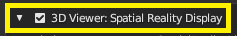

## Spatial Reality Display Plugin for Preview(BL)

 The Spatial Reality Display Plugin for Preview(BL) enables you to transfer and display 3DCG data created with DCC tool.
The app can be used to check data during the modeling process, check animations, or check 3DCG structures in the final stage of production.

- Functions provided by the app: Camera settings, scene transfer, scene control synchronization, application of animation, etc.
- Some data may not be able to correctly reflect scene in 3D display.
- Depending on the data, it may take a certain amount of time to transfer scenes.

For more information, please see the documents.(Available after 2023/12/21)
- [Manual in English](https://www.sony.net/Products/appselect-spatial-reality-display/en/appDetail/dcctool/ec30e15984a01255/)
- [Manual in Japanese](https://www.sony.net/Products/appselect-spatial-reality-display/jp/appDetail/dcctool/ec30e15984a01255/)

## Spatial Reality Display

 The Spatial Reality Display reproduces spatial images in three dimensions as if they were real 
and can be viewed by the naked eye without special glasses or headsets. 
It allows you to see the depth, texture, and appearance of the object with a real sense of presence, 

Please see overview page
 
- [OVERVIEW in English](https://www.sony.net/Products/Developer-Spatial-Reality-display/en/develop/Overview.html)
- [OVERVIEW in Japanese](https://www.sony.net/Products/Developer-Spatial-Reality-display/jp/develop/Overview.html)

## Usage

Please complete all of the following preparations.

To set-up the Spatial Reality Display development environment, go to Setting Up Spatial Reality Display.

- [SetupSRDisplay in English](https://www.sony.net/Products/Developer-Spatial-Reality-display/en/develop/Setup/SetupSRDisplay.html)
- [SetupSRDisplay in Japanese](https://www.sony.net/Products/Developer-Spatial-Reality-display/jp/develop/Setup/SetupSRDisplay.html)

To set-up Setting Up Spatial Reality Display Settings.

- [SetupSRRuntime in English](https://www.sony.net/Products/Developer-Spatial-Reality-display/en/develop/Setup/SetupSRRuntime.html)
- [SetupSRRuntime in Japanese](https://www.sony.net/Products/Developer-Spatial-Reality-display/jp/develop/Setup/SetupSRRuntime.html)

To set-up Spatial Reality Display Plugin for Preview(BL)
(Available after 2023/12/21)

- [Setup Spatial Reality Display Plugin for Preview(BL) in English](https://www.sony.net/Products/appselect-spatial-reality-display/en/appDetail/dcctool/ec30e15984a01255/)
- [Setup Spatial Reality Display Plugin for Preview(BL) in Japanese](https://www.sony.net/Products/appselect-spatial-reality-display/jp/appDetail/dcctool/ec30e15984a01255/)

## How to install

Please do install for Spatial Reality Display in usage chapter in advance.

  1. Run "src/build.bat"
  2. SpatialRealityDisplayPluginBle_X_X_X.zip is auto generated in the src folder.
  3. Launch Blender Application
  4. Click Edit > Preferences,
  5. Click on the Add-Ons tab, then click  "Install…" in the top right corner of the window.
  6. Navigate to the add on file (SpatialRealityDisplayPluginBle_X_X_X.zip), then click "Install Add-on" in the lower right.
  7. To enable an add-on check the box to the right of the add-ons shown in the figure below.

  

  If another version add-on is already installed, please disable the add-on uncheck the box once.

Reference Guild about Add-ons

- [Blender Add-on English page](https://docs.blender.org/manual/en/3.6/editors/preferences/addons.html)
- [Blender Add-on Japanese page](https://docs.blender.org/manual/ja/3.6/editors/preferences/addons.html)

## Differences from official release

- Disable the edit mesh function of sync setting
- bl_info's name: "Spatial Reality Display OSS"
- bl_info's version: (0, 0, 0)

## About contributing

We appreciate contributors in the community, that are willing to improve our project.
For more information, please see the [CONTRIBUTING.md](./CONTRIBUTING.md).
